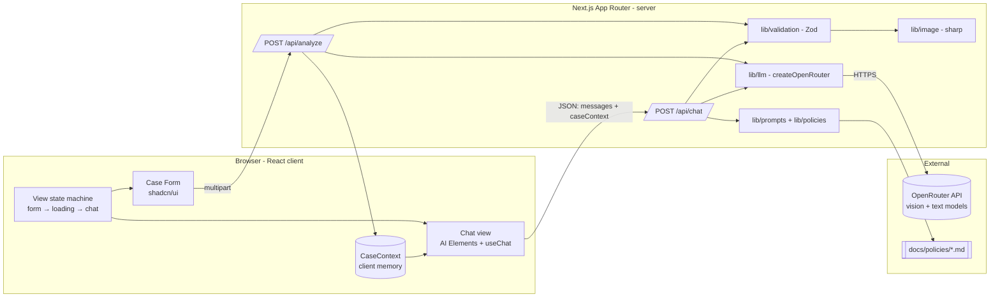
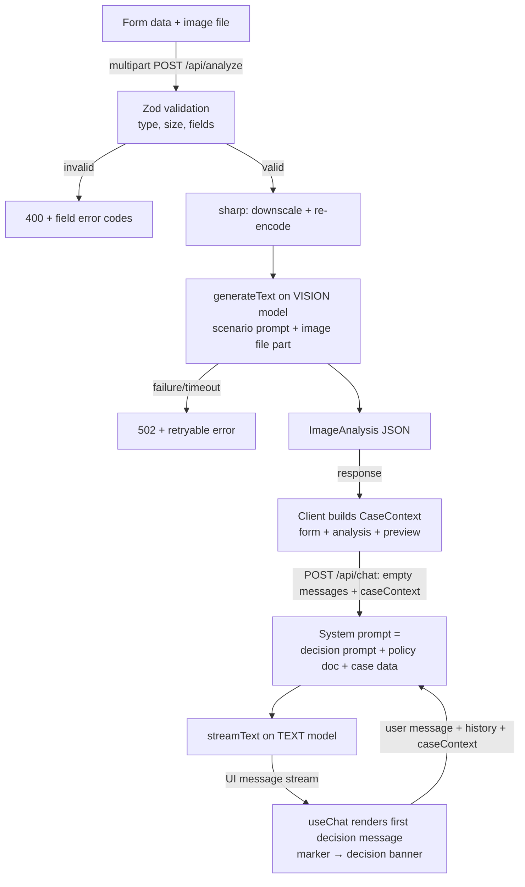
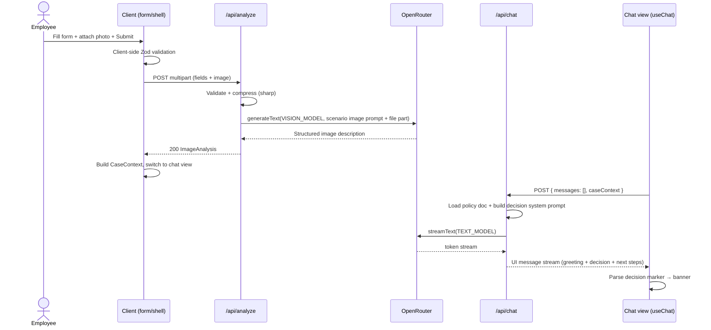
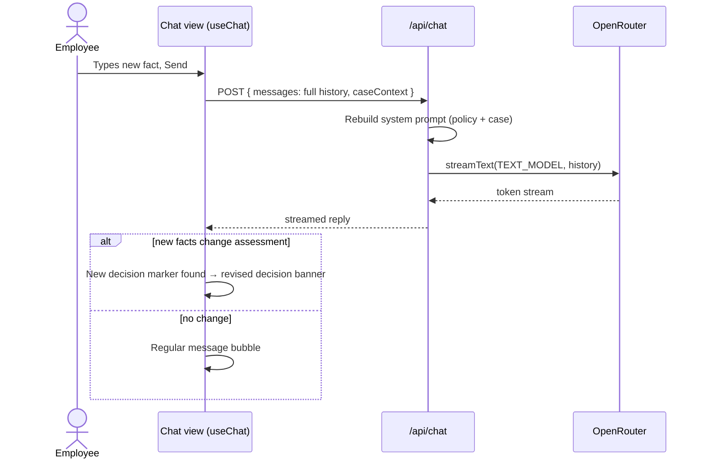
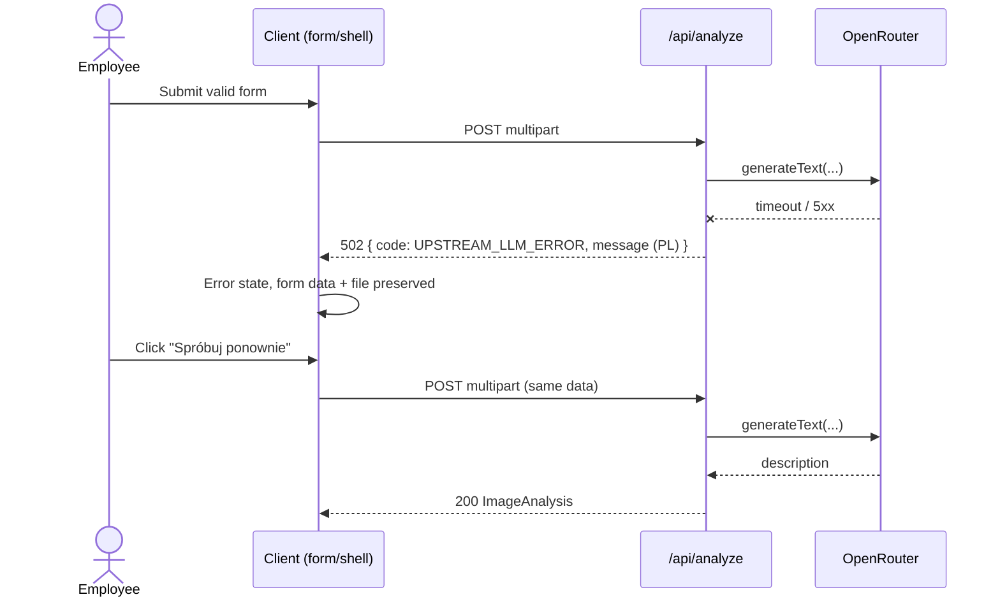

# ADR: Hardware Service Decision Copilot — Main Architecture

**Date:** 2026-07-14
**Status:** Accepted
**PRD:** [docs/PRD.md](../PRD.md)

---

## 1. Overview

This ADR defines the technical architecture for the Hardware Service Decision Copilot MVP described in `docs/PRD.md`: a web application in which a support employee submits a complaint/return case with a device photo, a multimodal LLM analyzes the photo, a reasoning LLM issues a policy-based decision, and the employee continues the case in a streaming chat.

The application is built **from an empty directory** (`app/` in this repository) — the implementing agent initializes the project itself (see Decision D-2). Two follow-up ADRs cover area details: `001-backend-api.md` (route handlers, LLM pipeline, prompts) and `002-frontend.md` (form, chat UI, state).

Research basis: current documentation fetched via Context7 on 2026-07-14 for AI SDK streaming (`streamText` → UI message stream response consumed by `useChat`), multimodal file parts, the OpenRouter AI SDK provider, AI Elements installation, and `create-next-app` non-interactive flags.

---

## 2. Context7 Library References

Implementing agents must use these handles to fetch docs — do not search for them again.

| Library | Context7 Handle | Used for |
|---|---|---|
| Vercel AI SDK | `/vercel/ai` | `generateText` (image analysis), `streamText` + UI message stream (decision & chat), `useChat` |
| OpenRouter AI SDK Provider | `/openrouterteam/ai-sdk-provider` | `createOpenRouter` provider wired to OpenRouter API |
| OpenRouter platform docs | `/websites/openrouter_ai` | Model IDs, API behavior, error semantics |
| Next.js | `/vercel/next.js` | App Router, route handlers, `create-next-app` |
| AI Elements | `/vercel/ai-elements` | Chat UI components (Conversation, Message, PromptInput, Response) |
| Shadcn/ui | `/shadcn-ui/ui` | Form, select, date picker, dialog, layout components |
| Tailwind CSS | `/tailwindlabs/tailwindcss.com` | Styling |
| React | `/reactjs/react.dev` | Client components, hooks |
| sharp | `/lovell/sharp` | Server-side image compression before LLM submission |
| Zod | `/colinhacks/zod` | Request validation on route handlers |

---

## 3. System Architecture

### Architecture pattern

Single **Next.js (App Router) monolith**: React frontend and backend API in one project. Backend logic lives in route handlers (`app/api/*`); there is no separate server. The app is **stateless on the server** — the full case context travels with each request (see Decision D-5). No database (PRD: persistence is out of MVP scope).

### Repository structure

The application lives in the repo's `app/` directory (per repository layout in AGENTS.md), on the participant branch. Inside it: a standard `create-next-app` layout with `src/` directory, `@/*` import alias, App Router. Conceptual areas:

- `src/app/` — pages (single page app shell) and API route handlers
- `src/components/` — form components (shadcn/ui) and chat components (AI Elements, installed into the repo)
- `src/lib/` — pure logic: validation schemas, prompt builders, policy loading, image compression, decision parsing
- `prompts/` or `src/lib/prompts/` — prompt templates (complaint/return × vision/decision)
- Policy documents are read from the repo's `docs/policies/` (see ADR-001 §policy loading)

### Technology stack

| Layer | Technology | Reason |
|---|---|---|
| Framework | Next.js (App Router) + TypeScript (strict) | Single project for UI + API; required by course brief |
| Frontend | React + Tailwind CSS + shadcn/ui | Form controls (select, date picker, textarea, file input) ready-made; AI Elements builds on shadcn |
| Chat UI | AI Elements | Official Vercel components with out-of-the-box `useChat`/streaming support; copied into repo = fully customizable |
| AI orchestration | Vercel AI SDK (`ai`, `@ai-sdk/react`) | `generateText` for image analysis, `streamText` for decision/chat, `useChat` on the client |
| LLM access | OpenRouter via `@openrouter/ai-sdk-provider` | Course-provided `OPENROUTER_API_KEY`; models set via env vars |
| Image processing | sharp | De-facto standard Node image library; resize + re-encode before LLM |
| Validation | Zod | Shared request/response validation on API boundary |
| Database | none (in-memory client state) | PRD out-of-scope; stateless server avoids session bugs |
| Unit/integration tests | Vitest | Fast, TS-native; mocks per AGENTS.md test strategy |
| E2E tests | Playwright | Real stack per AGENTS.md test strategy |

---

## 4. Module Structure & Dependencies

Dependency direction is strictly: **UI → API contracts → lib**. No module imports upward. No circular dependencies.

- **`lib/validation`** — Zod schemas for the case form, upload constraints, chat request body. Depends on: nothing. Used by: API routes, frontend form.
- **`lib/image`** — compression/downscale of the uploaded image; returns compressed binary + media type. Depends on: sharp. Used by: analyze route.
- **`lib/policies`** — loads the correct policy markdown (return vs complaint) from `docs/policies/`. Depends on: filesystem. Used by: chat/decision route.
- **`lib/prompts`** — builds the four prompts (vision-complaint, vision-return, decision-complaint, decision-return) from case data. Depends on: `lib/policies` types. Used by: API routes.
- **`lib/llm`** — constructs the OpenRouter provider from env vars; exposes text-model and vision-model handles. Depends on: `@openrouter/ai-sdk-provider`. Used by: API routes.
- **`lib/decision`** — decision-marker protocol: definition of the four categories and parsing of the marker from message text (see ADR-001 D-101). Depends on: nothing. Used by: frontend (banner rendering), tests.
- **`api/analyze` route** — validates multipart form, compresses image, calls vision model, returns case context. Depends on: validation, image, prompts, llm.
- **`api/chat` route** — receives case context + UI messages, injects policy + system prompt, streams decision/chat replies. Depends on: validation, policies, prompts, llm.
- **`components/case-form`** — the case form screen. Depends on: shadcn/ui, `lib/validation` (client-side reuse).
- **`components/chat`** — chat screen built from AI Elements + decision banner. Depends on: `@ai-sdk/react` (`useChat`), `lib/decision`.
- **`app` page shell** — view state machine (form → loading → chat, error states). Depends on: both component areas.

---

## 5. Data Models

All models are conceptual; exact field naming is fixed in ADR-001 §4 so frontend and backend agree.

- **CaseForm** — request type (`complaint` | `return`), equipment category (enum from PRD AC-02), model name (string), purchase date (ISO date, not future), reason (string; required for complaints), image (file: JPEG/PNG/WebP ≤ 10 MB). Lives: client form state; sent once to `/api/analyze` as multipart.
- **ImageAnalysis** — structured description produced by the vision model: whether damage/usage signs are visible, damage type, probable cause class (complaint) or resellability assessment (return), plus a mismatch flag when the photo does not show the declared equipment. Lives: returned by `/api/analyze`, then held in client memory and echoed to `/api/chat` in every request.
- **CaseContext** — CaseForm fields (minus the raw image) + ImageAnalysis + a client-generated case ID (binding field definition in ADR-001 §4 — no image data). The image preview for the summary panel is held separately on the client as an object URL/data URL (ADR-002) and is never part of CaseContext. Lives: client memory only; lost on refresh (per PRD).
- **Decision** — one of `APPROVED` | `REJECTED` | `NEEDS_MORE_INFO` | `ESCALATE`, extracted from the agent message via the marker protocol. Lives: derived on the client from message text; the latest marker in the conversation is the current decision.
- **Chat messages** — AI SDK `UIMessage` list managed by `useChat`. Lives: client memory only.

---

## 6. API / Interface Contracts

Two endpoints. Full request/response field definitions in ADR-001 §5.

### `POST /api/analyze`
- **Input:** multipart form data — all CaseForm fields + image file.
- **Behavior:** validate (Zod + file type/size), compress image (sharp), call vision model (`generateText`, scenario-specific prompt, image as file part), return ImageAnalysis.
- **Output:** JSON — ImageAnalysis + echo of validated case fields.
- **Errors:** 400 validation (typed error codes per field, incl. file type/size), 502 upstream LLM failure/timeout, each with a human-readable Polish message (PRD AC-28).
- **Notes:** non-streaming; no auth; single image.

### `POST /api/chat`
- **Input:** JSON — `messages` (UIMessage array; empty on the first call) + `caseContext` (CaseContext without raw image).
- **Behavior:** build system prompt from scenario decision prompt + policy document + case context; `streamText` on the text model; convert UI messages to model messages; stream response as UI message stream.
- **Output:** UI message stream response consumed by `useChat` (streaming, PRD AC-20/23). The first call (empty `messages`) produces the greeting + decision message.
- **Errors:** 400 invalid body; stream error propagated to `useChat` error state (client shows retry, PRD AC-27).
- **Notes:** stateless — context re-sent on every call; conversation history included by `useChat`.

---

## 7. Environment Variables

Aligned with the repository's `.env.example` (names must match exactly).

| Variable | Purpose | Required | Example value |
|---|---|---|---|
| `OPENROUTER_API_KEY` | OpenRouter authentication | Yes | `sk-or-v1-…` |
| `OPENROUTER_BASE_URL` | OpenRouter API base URL | No (default `https://openrouter.ai/api/v1`) | `https://openrouter.ai/api/v1` |
| `OPENROUTER_TEXT_MODEL` | Chat, decision, policy reasoning model | Yes | `openai/gpt-5.4-mini` |
| `OPENROUTER_VISION_MODEL` | Multimodal image analysis model | Yes | `openai/gpt-5.4-mini` |
| `OPENROUTER_MODEL` | Fallback when a split model var is missing (non-production) | No | `openai/gpt-5.4-mini` |
| `PORT` | Dev server port | No (default 3000) | `3000` |

The app must fail fast with a clear startup/request error when `OPENROUTER_API_KEY` is missing.

---

## 8. Technical Decisions

### D-1: Single Next.js monolith with route handlers as the backend
**Status:** Accepted
**Date:** 2026-07-14
**Context:** The MVP needs a form UI, a chat UI, and two server-side LLM pipelines; the course brief mandates Next.js App Router + TypeScript strict.
**Decision:** One Next.js project in `app/`; backend logic in App Router route handlers; shared pure logic in `src/lib`.
**Rejected alternatives:**
- Separate Node/Express backend: second dev server, CORS, duplicated validation — no benefit at MVP scale.
- Next.js server actions instead of route handlers: `useChat` expects an HTTP streaming endpoint; route handlers are the documented AI SDK integration path.
**Consequences:**
- (+) One dev command, one deploy unit, shared types between client and server.
- (−) Backend logic bound to Next.js runtime conventions (route handler API).
**Review trigger:** If a non-JS backend stack is adopted or the app needs long-running jobs.

### D-2: Project initialization via non-interactive `create-next-app`
**Status:** Accepted
**Date:** 2026-07-14
**Context:** The repo's `app/` directory starts empty (README only); the implementing agent bootstraps the project itself and must do it deterministically (no interactive prompts).
**Decision:** Initialize with `create-next-app@latest` in `app/` using explicit flags: TypeScript, Tailwind, ESLint, App Router, `src/` directory, `@/*` import alias, npm (`--ts --tailwind --eslint --app --src-dir --import-alias "@/*" --use-npm`). Then: enable TS `strict` (create-next-app default, verify), run `shadcn init`, add required shadcn components, install AI Elements components via its CLI, and add runtime deps (`ai`, `@ai-sdk/react`, `@openrouter/ai-sdk-provider`, `sharp`, `zod`) and test deps (`vitest`, `@playwright/test`). Exact sequence in ADR-001/002.
**Rejected alternatives:**
- Cloning a starter template: unvetted dependencies; course goal is agent-driven initialization.
- Manual `package.json` assembly: slower, error-prone, no benefit over the official scaffolder.
**Consequences:**
- (+) Reproducible, documented, current defaults from the official tool.
- (−) `create-next-app` requires an empty target dir — the existing `app/README.md` must be moved/merged first.
**Review trigger:** If the group switches package manager or adds a monorepo tool.

### D-3: Vercel AI SDK with `streamText` + `useChat` for all conversational output
**Status:** Accepted
**Date:** 2026-07-14
**Context:** PRD requires a streamed first decision message and a streaming chat with typing indicator; research confirmed the documented pattern: route handler runs `streamText`, returns a UI message stream response, and `useChat` (default transport pointed at the endpoint) consumes it into `UIMessage` parts.
**Decision:** Use `streamText` → UI message stream response on `/api/chat`, consumed by `useChat` from `@ai-sdk/react`. The first decision message is produced by the same endpoint on the first call (empty message list) — one streaming mechanism for everything.
**Rejected alternatives:**
- `generateText` for the decision + streaming only for chat: two response paths, longer perceived wait, contradicts the chosen streaming UX.
- Raw SSE endpoint + custom client parsing: re-implements what AI SDK ships and is tested against.
**Consequences:**
- (+) One code path for first message and follow-ups; typing indicator, error and retry states come from `useChat` status.
- (−) The decision category must be extracted from streamed text (marker protocol, ADR-001 D-101) instead of a validated JSON field.
**Review trigger:** If decision categories must be machine-validated before display (then switch first message to structured output).

### D-4: OpenRouter as the only LLM gateway, models from env vars
**Status:** Accepted
**Date:** 2026-07-14
**Context:** The course VM provides `OPENROUTER_API_KEY`; `.env.example` defines split text/vision model vars with `openai/gpt-5.4-mini` defaults.
**Decision:** Use `@openrouter/ai-sdk-provider` (`createOpenRouter` with `apiKey` + `baseURL` from env). Vision calls use `OPENROUTER_VISION_MODEL`, text/decision/chat calls use `OPENROUTER_TEXT_MODEL`, falling back to `OPENROUTER_MODEL` when a split var is missing outside production.
**Rejected alternatives:**
- `@ai-sdk/openai` with overridden base URL: works, but loses OpenRouter-specific options and typed provider settings.
- Direct OpenRouter REST calls: re-implements streaming, retries, and message formats the AI SDK provides.
**Consequences:**
- (+) Model swap = env var change; no code change to try other OpenRouter models.
- (−) Two models must both be multimodal-capable if the group later merges pipelines; behavior varies per routed model.
**Review trigger:** If response quality of the default mini model is insufficient for image damage assessment.

### D-5: Stateless server; case context lives on the client
**Status:** Accepted
**Date:** 2026-07-14
**Context:** MVP has no database; a server-side in-memory session store would break on dev-server reload and adds session lifecycle logic the PRD doesn't need (refresh discards the case by design).
**Decision:** `/api/analyze` returns the full ImageAnalysis; the client keeps CaseContext in memory and sends it in the body of every `/api/chat` request. The server derives everything per-request.
**Rejected alternatives:**
- In-memory server session (Map keyed by case ID): lost on reload anyway, adds invalidation and mismatch failure modes.
- Persisting sessions to SQLite: explicitly out of MVP scope in the PRD.
**Consequences:**
- (+) Zero session bugs; trivially testable route handlers; matches PRD's "session in memory, lost on refresh".
- (−) Case context re-transmitted on each message (small JSON; image never re-sent — only its analysis).
**Review trigger:** When SQLite persistence (post-MVP feature) is implemented.

### D-6: AI Elements on shadcn/ui for the chat interface
**Status:** Accepted
**Date:** 2026-07-14
**Context:** PRD requires markdown-rendered streaming bubbles, typing indicator, auto-scroll, and a custom decision banner; research compared AI Elements, assistant-ui, and hand-rolled UI.
**Decision:** AI Elements (Conversation, Message, Response, PromptInput + related) installed via its CLI into the repo. Components are plain source files on shadcn/ui + Tailwind, integrate directly with `useChat`, and can be freely extended (decision banner inside message rendering).
**Rejected alternatives:**
- assistant-ui: mature, but introduces its own runtime abstraction over the AI SDK; more indirection than the MVP needs and diverges from the plain `useChat` pattern used in course materials.
- Custom components over raw `useChat`: markdown rendering, scroll behavior, and input states re-built by hand for no gain.
**Consequences:**
- (+) Streaming chat UI working out of the box; same design system (shadcn) as the form; full source ownership.
- (−) Installed components become repo code the team maintains (updates are manual re-installs).
**Review trigger:** If the chat needs threads/branching or server-driven generative UI beyond AI Elements' scope.

### D-7: TDD with Vitest (unit/integration) and Playwright (E2E)
**Status:** Accepted
**Date:** 2026-07-14
**Context:** AGENTS.md mandates TDD and a three-layer test strategy with defined mock boundaries (unit: mock all deps; integration: mock only the external LLM API; E2E: mock nothing).
**Decision:** Vitest for `src/lib` units and route-handler integration tests (LLM calls mocked at the provider boundary); Playwright for E2E against the running app. Details and scenarios in §10 and area ADRs.
**Rejected alternatives:**
- Jest: slower TS setup, no benefit over Vitest in a fresh Vite-compatible project.
- Skipping E2E in MVP: contradicts AGENTS.md ("E2E — NOTHING mocked — qa-engineer").
**Consequences:**
- (+) Agents self-validate at every layer; regression safety for prompt/contract changes.
- (−) Real-LLM E2E runs cost tokens and can be nondeterministic — E2E asserts flow/UI invariants, not exact LLM wording.
**Review trigger:** If E2E flakiness from live LLM responses blocks CI; then record cassettes/fixtures for E2E.

---

## 9. Diagrams

### 9.1 Architecture / Component Diagram

### 9.2 Data Flow Diagram

### 9.3 Sequence Diagrams

#### Form submission → image analysis → streamed decision (happy path)

#### Chat follow-up with decision revision

#### Analysis failure and retry (error path)

---

## 10. Testing Strategy

### Philosophy

TDD per AGENTS.md: write the test first, watch it fail for the right reason, implement minimally, keep the suite green while refactoring. Tests are the implementing agent's primary self-validation. Mock boundaries follow the AGENTS.md table: unit tests mock all dependencies; integration tests mock **only** the OpenRouter/LLM boundary; E2E mocks nothing.

### Test layers

| Layer | Type | Scope | Tools |
|---|---|---|---|
| Unit | Pure logic | `lib/validation`, `lib/prompts`, `lib/decision` (marker parsing), `lib/image` (compression params), env/model resolution | Vitest |
| Integration | Route handlers | `/api/analyze` and `/api/chat` request→response incl. error contract; LLM mocked at provider boundary (AI SDK mock provider) | Vitest |
| E2E | Full app | Form → analysis → streamed decision → chat follow-up; error and validation paths | Playwright |

### Key test scenarios

1. **Form validation matrix (unit + E2E)** — missing required fields, future purchase date, reason required only for complaints, file >10 MB, wrong MIME type. Expect: field-level Polish errors, no request sent (client) / 400 with typed codes (server).
2. **Image compression (unit)** — oversized input produces output within configured bounds and allowed media type; metadata stripped.
3. **Prompt selection (unit)** — request type `complaint` selects complaint vision+decision prompts and complaint policy; `return` selects return set; case fields present in built prompt.
4. **Decision marker parsing (unit)** — each of the four categories parsed from sample texts; malformed/missing marker yields "unknown" state without crash; latest marker wins across a message list.
5. **/api/analyze happy path (integration)** — valid multipart in, mocked vision reply out; response schema matches contract.
6. **/api/analyze upstream failure (integration)** — mocked provider error/timeout → 502 with `UPSTREAM_LLM_ERROR` code and Polish message.
7. **/api/chat first call (integration)** — empty `messages` + caseContext streams a first message; system prompt contains policy content and image analysis.
8. **/api/chat history call (integration)** — history is forwarded; case context still injected.
9. **E2E happy path** — submit complaint case with fixture photo → chat opens → first bubble contains a decision banner (one of four categories) and non-empty justification → send follow-up → new streamed reply appears.
10. **E2E retry path** — simulate upstream failure only if a controllable failure mode exists (e.g. invalid model env in a dedicated run); otherwise covered at integration layer.

### Technical acceptance criteria

- TAC-01: `npm run lint`, `npm run build`, and `npm test` all pass with zero errors in `app/`.
- TAC-02: TypeScript `strict` is enabled and the build contains no `any`-suppressing directives (`@ts-ignore`, `@ts-expect-error`) in `src/lib` and route handlers.
- TAC-03: `/api/analyze` rejects a 10.1 MB file and a `.gif` file with HTTP 400 and distinct machine-readable error codes.
- TAC-04: `/api/analyze` never forwards the original upload: the payload sent to the provider is the sharp-processed image (verified in integration test via mocked provider capture).
- TAC-05: `/api/chat` responds with a UI message stream (streaming response) consumable by `useChat`, for both the empty-history first call and follow-up calls.
- TAC-06: The system prompt for a complaint case contains the complaint policy text and never the return policy text (and vice versa) — asserted in integration tests.
- TAC-07: All four decision categories render a visually distinct banner in the chat (E2E smoke: banner element present with category attribute).
- TAC-08: With `OPENROUTER_API_KEY` unset, API routes return a clear 500-level configuration error (no silent hang), and the message does not leak other env values.
- TAC-09: Playwright E2E suite passes against `npm run dev` (or `start`) with real OpenRouter access.
