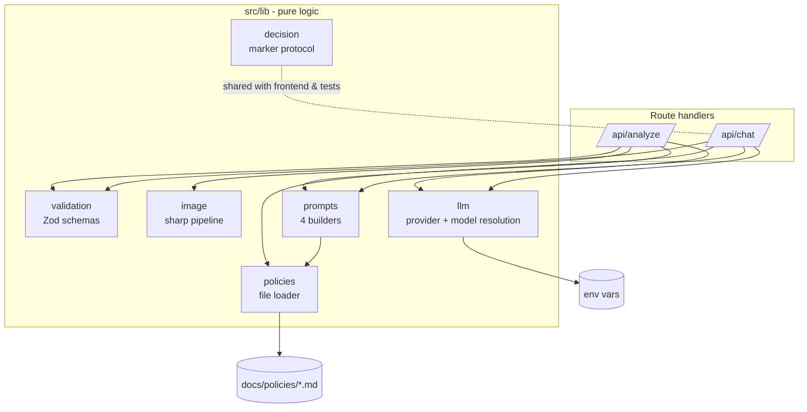
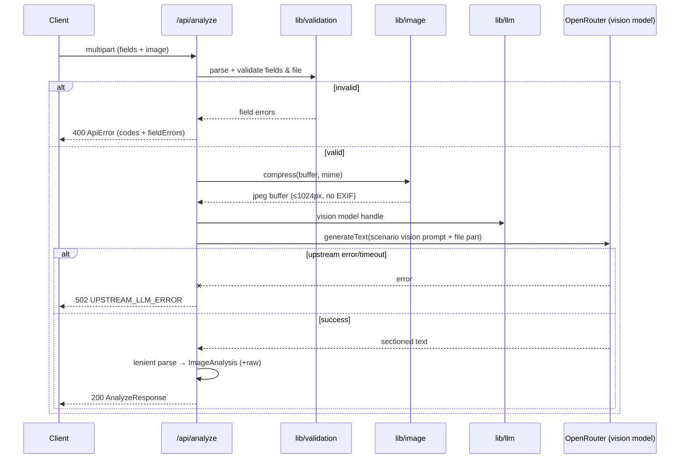
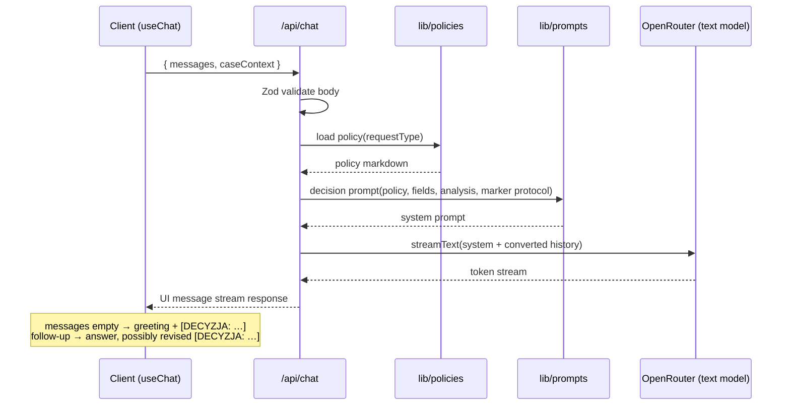

# ADR-001: Backend API & LLM Pipeline

**Date:** 2026-07-14
**Status:** Accepted
**Relates to:** `docs/ADR/000-main-architecture.md`

---

## 1. Scope

Covers the server side of the application: the two route handlers (`/api/analyze`, `/api/chat`), request validation, image compression, policy loading, prompt construction, the two-stage LLM pipeline, the decision-marker protocol, and the backend error contract.

Does NOT cover: UI components, client state, chat rendering (ADR-002); overall stack choices (ADR-000).

---

## 2. Context7 References

| Library | Context7 Handle | Used for |
|---|---|---|
| Vercel AI SDK | `/vercel/ai` | `generateText` with image file parts; `streamText` + UI message stream response; converting UI messages to model messages |
| OpenRouter AI SDK Provider | `/openrouterteam/ai-sdk-provider` | Provider construction (`createOpenRouter`), model settings |
| OpenRouter platform docs | `/websites/openrouter_ai` | Model behavior, rate limits, error responses |
| sharp | `/lovell/sharp` | Resize/re-encode uploaded image |
| Zod | `/colinhacks/zod` | Multipart/JSON body validation |
| Next.js | `/vercel/next.js` | Route handler conventions, request `formData()` handling, runtime config |

---

## 3. Component Design

### Layers

1. **Route handlers** (`/api/analyze`, `/api/chat`) — HTTP concerns only: parse body, call validation, orchestrate lib calls, map errors to the error contract. No business logic inline.
2. **`lib/validation`** — Zod schemas shared with the client: case form schema (with the complaint-conditional reason rule and non-future date rule), upload constraints (MIME allowlist: `image/jpeg`, `image/png`, `image/webp`; max 10 MB), chat body schema (messages + caseContext).
3. **`lib/image`** — one function: input buffer + declared MIME → compressed image (longest edge capped, re-encoded to JPEG at fixed quality, metadata stripped) + output media type. Compression target: payload small enough for LLM submission (longest edge 1024 px, JPEG quality ~80 — constants in one place).
4. **`lib/policies`** — resolves scenario → policy file path (`docs/policies/return-policy.md` / `docs/policies/complaint-policy.md`), reads at request time (no caching needed at MVP scale), errors if missing.
5. **`lib/prompts`** — four builder functions:
   - *vision-complaint*: instructs the vision model to describe damage presence, damage type, probable cause class, and whether the photo shows the declared equipment; output as structured description (fixed sections), **no decision**.
   - *vision-return*: same structure but assesses signs of use, completeness visible on photo, resellability as new.
   - *decision-complaint* / *decision-return*: system prompts embedding (a) the agent behavior spec from PRD §11 (role, four categories, not-allowed list, recommendation framing, Polish language), (b) the full policy document text, (c) the case fields, (d) the ImageAnalysis, and (e) the **decision-marker protocol** (D-101).
6. **`lib/llm`** — builds the OpenRouter provider from env (`OPENROUTER_API_KEY`, `OPENROUTER_BASE_URL`); resolves model IDs: text → `OPENROUTER_TEXT_MODEL` ?? `OPENROUTER_MODEL`, vision → `OPENROUTER_VISION_MODEL` ?? `OPENROUTER_MODEL`; throws a typed configuration error when the key or all model vars are missing.

### State

None on the server (ADR-000 D-5). Every request is self-contained.

---

## 4. Data Structures

Field names below are the binding contract between backend and frontend (ADR-002 uses the same names).

- **CaseFields** — `requestType` (`"complaint" | "return"`), `category` (enum per PRD AC-02), `modelName` (string, 1–200 chars), `purchaseDate` (ISO `YYYY-MM-DD`, ≤ today), `reason` (string; min 10 chars when `requestType === "complaint"`, optional otherwise).
- **ImageAnalysis** — `depictsDeclaredEquipment` (boolean), `summary` (string, Polish), `damage` (`{ present: boolean, types: string[], probableCause: string | null }`), `usageSigns` (`{ present: boolean, details: string[] }`), `resellableAsNew` (boolean | null — null for complaint scenario), `raw` (string — full model text, for the decision prompt).
- **CaseContext** — `caseId` (client-generated UUID), `fields` (CaseFields), `analysis` (ImageAnalysis). No raw image data.
- **AnalyzeResponse** — `{ ok: true, fields: CaseFields, analysis: ImageAnalysis }`.
- **ApiError** — `{ ok: false, code: string, message: string (Polish), fieldErrors?: Record<string, string> }`. Codes: `VALIDATION_ERROR`, `FILE_TOO_LARGE`, `UNSUPPORTED_FILE_TYPE`, `UPSTREAM_LLM_ERROR`, `CONFIG_ERROR`.
- **ChatRequest** — `{ messages: UIMessage[], caseContext: CaseContext }`.

---

## 5. Interface Contracts

### `POST /api/analyze`
- **Input:** `multipart/form-data`: all CaseFields as string fields + `image` file part.
- **Validation order:** field schema → file MIME (from actual content sniffing, not extension alone) → file size ≤ 10 MB.
- **Success:** 200, `AnalyzeResponse` JSON.
- **Errors:** 400 `VALIDATION_ERROR` (with `fieldErrors`), 400 `UNSUPPORTED_FILE_TYPE`, 400 `FILE_TOO_LARGE`, 502 `UPSTREAM_LLM_ERROR` (retryable — client keeps data), 500 `CONFIG_ERROR`.
- **Vision output handling:** the model is prompted to answer in a fixed section format; the handler parses it into ImageAnalysis fields with tolerant fallbacks (unparsed → sensible defaults + full text in `raw`; `depictsDeclaredEquipment` defaults to true only when parsing succeeded and no mismatch was flagged).

### `POST /api/chat`
- **Input:** JSON `ChatRequest`. `messages` empty ⇒ first decision message; non-empty ⇒ follow-up.
- **Behavior:** validate body → load policy for `fields.requestType` → build scenario decision system prompt → convert `messages` to model messages → `streamText` on text model → return UI message stream response.
- **Success:** streaming UI message response (consumed by `useChat`).
- **Errors:** 400 `VALIDATION_ERROR`; upstream/stream errors surface through the stream's error handling so `useChat` enters its error state; 500 `CONFIG_ERROR`.

---

## 6. Technical Decisions

### D-101: Decision category via marker line in streamed text
**Status:** Accepted
**Date:** 2026-07-14
**Context:** The decision message streams as free text (ADR-000 D-3), but the UI must render a machine-readable decision banner (PRD AC-14/20/22) and tests must assert the category.
**Decision:** The decision system prompt requires the agent to place a marker line `[DECYZJA: <CATEGORY>]` (one of `APPROVED|REJECTED|NEEDS_MORE_INFO|ESCALATE`) as the **first line** of any message that issues or revises a decision. `lib/decision` exposes the parser (shared by frontend and tests): extract marker, strip it from display text, "latest marker in conversation wins".
**Rejected alternatives:**
- Structured output (JSON) for the first message: loses streaming UX or requires a second render path; category validation gain not worth it at MVP (review trigger in D-3 covers the switch).
- Message metadata via stream options: metadata is produced server-side, but the category is decided *by the model inside the text*; server would have to parse the full text anyway before it could attach metadata reliably.
**Consequences:**
- (+) Works with plain `streamText`; single parser reused by UI and tests; revision detection is trivial.
- (−) Prompt-compliance risk: a model may omit/malform the marker — parser must degrade gracefully (no banner, message still shown) and integration tests assert marker presence with the mocked model only.
**Review trigger:** If real-model marker omission is observed repeatedly in E2E runs.

### D-102: Vision stage returns structured-by-convention text, parsed leniently
**Status:** Accepted
**Date:** 2026-07-14
**Context:** Stage 1 output feeds both the decision prompt (as text) and the UI/case context (as fields, e.g. mismatch flag per PRD AC-13).
**Decision:** Prompt the vision model to answer in fixed labeled sections (Polish labels mirroring ImageAnalysis fields); parse into ImageAnalysis with lenient fallbacks and always keep the full text in `raw` for the decision prompt. Do not use provider-level structured output for the vision call.
**Rejected alternatives:**
- JSON-mode structured output for vision: support varies across OpenRouter-routed models; a failed JSON parse would block the flow, while lenient text parsing never does.
- Passing raw vision text only (no fields): UI could not distinguish mismatch (AC-13) without re-parsing on the client.
**Consequences:**
- (+) Robust to model variation; decision agent gets full nuance via `raw`.
- (−) Parser needs its own unit tests and tolerant defaults.
**Review trigger:** If the chosen vision model reliably supports structured output and mismatch detection accuracy becomes a problem.

### D-103: Image compression with sharp before any LLM submission
**Status:** Accepted
**Date:** 2026-07-14
**Context:** PRD AC-10 mandates backend compression; uploads may approach 10 MB while vision models need far less resolution.
**Decision:** `lib/image` re-encodes every accepted upload with sharp: longest edge capped at 1024 px, JPEG output at quality ~80, metadata (EXIF/GPS) stripped. The compressed buffer is attached to the vision call as an image file part (AI SDK `type: 'file'`, `mediaType: 'image/jpeg'`, binary data).
**Rejected alternatives:**
- Client-side canvas compression: PRD places the responsibility on the backend; client compression can be added later as an optimization, never as the enforcement point.
- Sending original when already small: uniform pipeline is simpler and strips metadata consistently (privacy).
**Consequences:**
- (+) Predictable token/payload cost; PII in EXIF removed; single tested path.
- (−) sharp is a native dependency — must install cleanly on Windows dev VMs and the CI runner (prebuilt binaries cover both).
**Review trigger:** If damage details are lost at 1024 px for real cases (raise cap or make it scenario-dependent).

### D-104: Policies read from `docs/policies/` at request time
**Status:** Accepted
**Date:** 2026-07-14
**Context:** The policy documents already exist in the repo (`docs/policies/*.md`, referenced by the PRD); the decision prompt must embed the full current text.
**Decision:** `lib/policies` reads the markdown file matching the scenario on each `/api/chat` request, relative to the repo root. Missing file ⇒ `CONFIG_ERROR`.
**Rejected alternatives:**
- Copying policies into `app/` at build time: two sources of truth; course flow edits policies live and expects behavior change without rebuild.
- Hardcoding policy text in prompts: unverifiable against the documents the PRD references.
**Consequences:**
- (+) Editing a policy file changes agent behavior on the next request — ideal for course demos.
- (−) Runtime dependency on repo layout outside `app/` — the path must be configurable for deployment scenarios.
**Review trigger:** When the app is deployed outside the repo (then bundle policies or move to DB/RAG post-MVP).

---

## 7. Diagrams

### Component Diagram

### Sequence Diagram — /api/analyze internals

### Sequence Diagram — /api/chat internals (first call and follow-up)

---

## 8. Testing Strategy

TDD; mock boundaries per ADR-000 §10. Provider mocked with the AI SDK's mock/test model utilities at the `lib/llm` boundary in integration tests.

### Test scenarios for this area

| Scenario | Type | Input | Expected output | Edge cases |
|---|---|---|---|---|
| Field validation | Unit | CaseFields variants | Pass/fail with exact field errors | future date; complaint w/o reason; return w/o reason (OK); 201-char modelName |
| File constraints | Unit/Integration | files of various MIME/size | `UNSUPPORTED_FILE_TYPE` / `FILE_TOO_LARGE` / pass | 10 MB exactly (pass); content-sniff mismatch vs extension |
| Compression | Unit | 4000×3000 PNG 9 MB | JPEG ≤1024px longest edge, no EXIF | already-small image; WebP input |
| Prompt builders | Unit | complaint/return contexts | correct prompt set; policy text embedded; marker protocol text present | reason absent for return |
| Vision output parsing | Unit | well-formed / partial / free-form text | ImageAnalysis with fallbacks; `raw` always full | mismatch flag detection |
| Marker parsing | Unit | texts with each category, none, malformed | category or null; display text stripped | marker mid-message ignored (first line only); multiple messages → latest wins |
| Analyze happy path | Integration | valid multipart, mocked vision | 200 AnalyzeResponse schema-valid | — |
| Analyze upstream failure | Integration | mocked provider throw/timeout | 502 `UPSTREAM_LLM_ERROR`, Polish message | — |
| Chat first call | Integration | empty messages + context, mocked stream | streaming response; system prompt contains policy + analysis + marker protocol | complaint vs return policy isolation (TAC-06) |
| Chat follow-up | Integration | 3-message history + context | history forwarded in order; context injected | — |
| Missing env | Integration | no `OPENROUTER_API_KEY` | 500 `CONFIG_ERROR`, no env leakage | missing model vars with `OPENROUTER_MODEL` fallback present |

### Technical acceptance criteria

- TAC-001-01: `/api/analyze` accepts exactly `image/jpeg`, `image/png`, `image/webp` (content-sniffed) and rejects everything else with `UNSUPPORTED_FILE_TYPE`.
- TAC-001-02: The image payload sent to the provider is always the sharp output: JPEG, longest edge ≤ 1024 px, no EXIF metadata (verified via mocked provider capture).
- TAC-001-03: All `ApiError` responses match the `{ ok:false, code, message, fieldErrors? }` shape and `message` is Polish for every defined code.
- TAC-001-04: Vision-stage parser never throws on arbitrary model text (property/fuzz-style unit test with malformed inputs).
- TAC-001-05: The decision system prompt embeds the complete policy file content for the scenario and the marker-protocol instruction verbatim.
- TAC-001-06: `lib/decision` parser strips the marker from display text and returns the category; on missing/malformed marker it returns null and the original text unchanged.
- TAC-001-07: Model resolution: with `OPENROUTER_TEXT_MODEL` unset and `OPENROUTER_MODEL` set, the text model resolves to `OPENROUTER_MODEL`; with both unset, `CONFIG_ERROR`.
