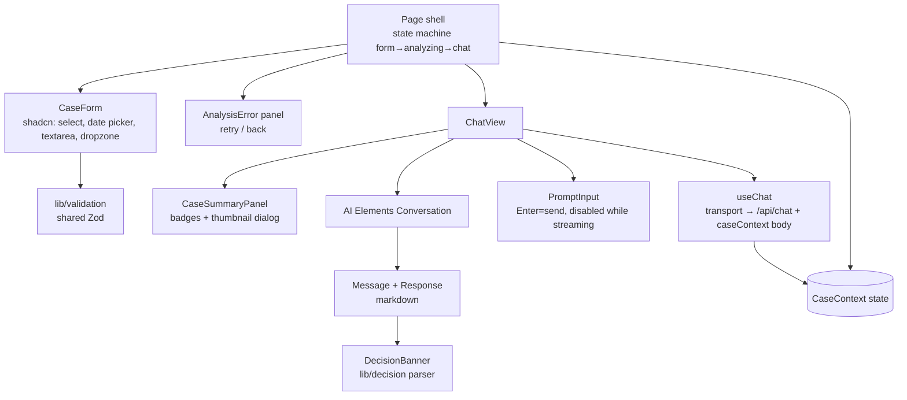
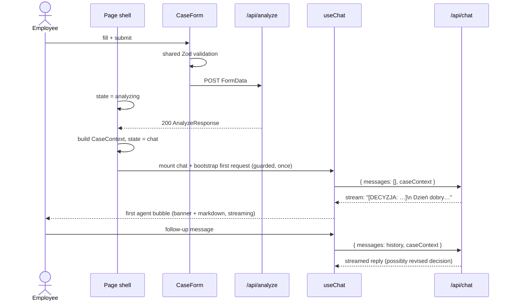
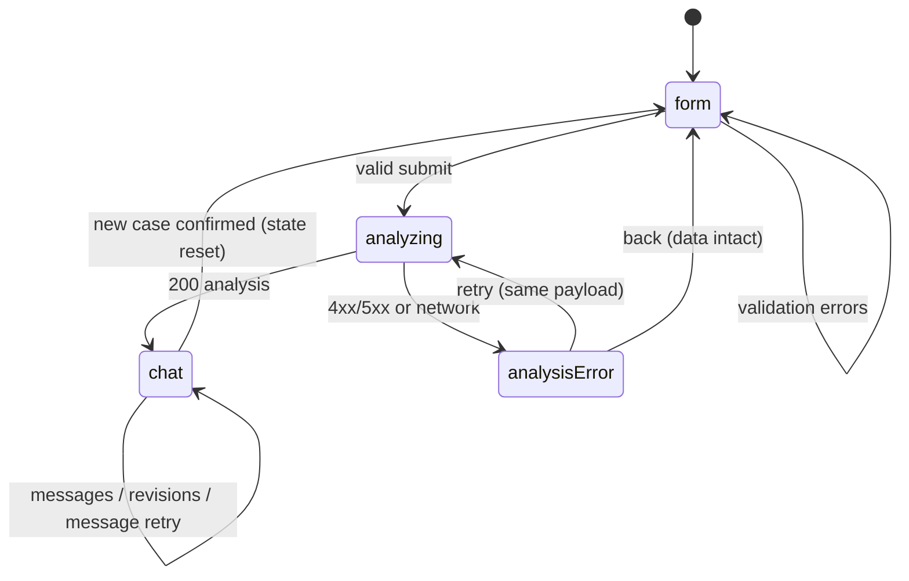

# ADR-002: Frontend — Case Form, View Shell & Chat UI

**Date:** 2026-07-14
**Status:** Accepted
**Relates to:** `docs/ADR/000-main-architecture.md`

---

## 1. Scope

Covers the client side: project initialization sequence, the case form screen, the view state machine, the chat screen built on AI Elements with `useChat`, the decision banner, client-held case state, and all client-visible error/loading states.

Does NOT cover: route handler internals, prompts, policies (ADR-001); stack rationale (ADR-000).

---

## 2. Context7 References

| Library | Context7 Handle | Used for |
|---|---|---|
| AI Elements | `/vercel/ai-elements` | Conversation, Message, Response, PromptInput, Loader components |
| Vercel AI SDK | `/vercel/ai` | `useChat` (`@ai-sdk/react`), transport configuration, `UIMessage` parts |
| Shadcn/ui | `/shadcn-ui/ui` | Form, Select, Calendar/DatePicker, Textarea, Input, Dialog, Badge, Card |
| Next.js | `/vercel/next.js` | App Router pages, client components, `create-next-app` |
| Tailwind CSS | `/tailwindlabs/tailwindcss.com` | Styling and layout |
| Zod | `/colinhacks/zod` | Client-side reuse of `lib/validation` schemas |
| React | `/reactjs/react.dev` | State machine, controlled form |

---

## 3. Component Design

### Initialization sequence (agent-executed, deterministic)

1. Move/merge the existing `app/README.md` aside (create-next-app requires an effectively empty directory).
2. `create-next-app@latest` in `app/` with flags: `--ts --tailwind --eslint --app --src-dir --import-alias "@/*" --use-npm` (flags verified against current CLI docs). Verify `tsconfig.json` has `"strict": true`.
3. `shadcn` init (defaults matching Tailwind config), then add components: form, input, select, textarea, calendar + popover (date picker), button, card, dialog, badge, alert.
4. Install AI Elements components via its CLI (`ai-elements` — all components, or minimum: conversation, message, response, prompt-input, loader). Components land in `src/components/ai-elements/` as owned source.
5. Install runtime deps: `ai`, `@ai-sdk/react`, `@openrouter/ai-sdk-provider`, `sharp`, `zod`; dev deps: `vitest`, `@vitejs/plugin-react`, `@playwright/test`.
6. Copy `.env.example` → `.env` (developer supplies real key; `.env` stays gitignored).

### View shell — state machine

A single page holds an explicit client state machine (React state; no router navigation needed):

- `form` → initial and after "new case" confirmation.
- `analyzing` → after valid submit; staged progress text (PRD §9.1); transitions to `chat` on 200, `analysisError` on failure.
- `analysisError` → shows ApiError message + "Spróbuj ponownie" (re-POST same payload) + "Wróć do formularza" (back with data intact). Form values and the selected `File` object are kept in React state the whole time — never cleared until a new case is confirmed.
- `chat` → chat screen; "Nowe zgłoszenie" opens a confirm dialog; confirm ⇒ reset all state ⇒ `form`.

### Case form (`components/case-form`)

- Controlled form using the shared Zod schema (same rules as backend: conditional reason, non-future date, file type/size).
- Request type as a two-option segmented control; switching updates the reason field's required marker and helper text dynamically (PRD AC-04).
- File input with drop zone: on selection, client-side pre-check of MIME/size, thumbnail preview via object URL, remove (X) control.
- On submit: validate → on error, render per-field messages and scroll first invalid field into view; on success, build `FormData` and POST `/api/analyze`.

### Chat screen (`components/chat`)

- `useChat` from `@ai-sdk/react`, transport pointed at `/api/chat`, with the request body extended to carry `caseContext` on **every** request (AI SDK transport supports custom body fields; exact option verified via Context7 at implementation time).
- **First message trigger:** on entering `chat` state, the client immediately issues the first chat request with empty visible history so the decision streams in as the first assistant message. The concrete mechanism (an initial `sendMessage` with a hidden bootstrap user turn, or a direct transport call with empty messages) is chosen at implementation time against current `useChat` docs — requirement: **no user-authored text appears before the first agent bubble** (PRD: first message is from the agent).
- Rendering: AI Elements `Conversation` (auto-scroll + scroll button) → `Message`/`MessageContent` per `UIMessage`, text parts through `Response` (markdown). `PromptInput` with textarea (Enter sends, Shift+Enter newline — AI Elements default), submit disabled while `status` is streaming/submitted (PRD AC-23).
- **Decision banner:** for each assistant message, run the shared `lib/decision` parser on its text; when a marker is found, render a banner component (category-specific label, icon, and `data-decision` attribute for tests) above the message body, and strip the marker line from the rendered markdown. The newest banner in the thread is the current decision (revisions appear naturally as new banners, PRD AC-22).
- **Case summary panel:** collapsible panel (sidebar on desktop) showing request type badge, category, model, purchase date, reason excerpt, and the image thumbnail (click ⇒ dialog with larger preview from the client-held object URL/data URL).
- **Error states:** `useChat` error status renders an inline error bubble with "Ponów" wired to the SDK's regenerate/retry; history preserved (PRD AC-27).

### Client state

- `CaseContext` (fields + analysis + caseId) in React state at the shell level; passed down to chat.
- Image preview kept client-side as object URL/data URL (the server never returns image bytes).
- No persistence: refresh loses everything (PRD-consistent).

---

## 4. Data Structures

- **FormState** — CaseFields + `imageFile: File | null` + per-field error map (from Zod flatten).
- **ShellState** — `"form" | "analyzing" | "analysisError" | "chat"` + `apiError: ApiError | null`.
- **CaseContext** — as defined in ADR-001 §4 (same field names, imported from shared types).
- **DecisionView** — `{ category: "APPROVED" | "REJECTED" | "NEEDS_MORE_INFO" | "ESCALATE", messageId: string }`, derived per render from messages via `lib/decision`; latest wins.

---

## 5. Interface Contracts

Consumes:
- `POST /api/analyze` — sends `FormData` (CaseFields as strings + `image` file); handles 200 `AnalyzeResponse`, 400 `VALIDATION_ERROR`/`FILE_*` (map `fieldErrors` onto the form), 502 `UPSTREAM_LLM_ERROR` (analysisError state), 500 `CONFIG_ERROR` (analysisError state, non-retryable hint).
- `POST /api/chat` — via `useChat` transport; body = `{ messages, caseContext }`; consumes UI message stream.

Exposes: none (leaf of the dependency graph).

---

## 6. Technical Decisions

### D-201: Single-page state machine instead of routes
**Status:** Accepted
**Date:** 2026-07-14
**Context:** The flow form → loading → chat is strictly linear with client-only state that must survive transitions (file object, case context); URL navigation would lose or force serialization of that state.
**Decision:** One App Router page with an explicit four-state client machine; no multi-route navigation.
**Rejected alternatives:**
- `/form` and `/chat` routes: state must be lifted to storage or context providers across routes; refresh semantics get murky; zero UX gain in MVP.
- Modal-based chat over the form: PRD describes a full chat screen with summary panel.
**Consequences:**
- (+) File + context state trivially preserved for retry (PRD AC-26); simple to test.
- (−) No deep-linking to a case (irrelevant while sessions are non-persistent).
**Review trigger:** When session persistence lands (post-MVP) and cases become addressable.

### D-202: First decision message bootstrapped through the same `useChat` pipeline
**Status:** Accepted
**Date:** 2026-07-14
**Context:** PRD requires the first chat bubble to be an agent message (greeting + decision) that streams; `useChat` is message-driven and normally starts from a user action.
**Decision:** On entering the chat state, the client immediately triggers one chat request through the `useChat` transport with the case context and no user-visible prompt text; the assistant's streamed reply becomes the first visible message. The server treats "no prior assistant message" as the decision request (ADR-001). Any bootstrap user turn must be hidden from rendering.
**Rejected alternatives:**
- Fetching the first message via `/api/analyze` response and seeding `useChat` initial messages: makes the decision non-streamed (rejected in PRD clarification) and creates a second formatting path.
- A separate SSE endpoint for the first message: duplicates the streaming machinery.
**Consequences:**
- (+) One streaming/rendering/error path for all agent output; decision revision logic identical to first decision.
- (−) Requires care that the bootstrap turn never renders and is not double-sent (StrictMode double-effect guard); exact `useChat` API for this verified against current docs during implementation.
**Review trigger:** If the AI SDK version in use offers a first-class "assistant-initiated conversation" API.

### D-203: Decision banner derived at render time from message text
**Status:** Accepted
**Date:** 2026-07-14
**Context:** Banners must reflect streamed content (marker arrives in the first tokens) and revisions in later messages (PRD AC-20/22), with no server-side session state.
**Decision:** Parse every assistant message with the shared `lib/decision` parser during render; render banner + stripped text. While streaming, the banner appears as soon as the marker line is complete; "current decision" = last parsed marker in the thread.
**Rejected alternatives:**
- Storing decision in React state via `onFinish` callback: duplicates derivable state; breaks on retry/regenerate; loses banner-during-streaming.
- Server-attached message metadata: rejected in ADR-001 D-101 (server would parse text anyway).
**Consequences:**
- (+) Zero extra state; revisions and retries handled for free; testable pure function.
- (−) Marker text briefly visible if parsing were skipped — mitigated by always stripping through the same component path.
**Review trigger:** Same as D-101 (marker reliability with real models).

### D-204: Shared Zod schemas imported by the form (single source of validation truth)
**Status:** Accepted
**Date:** 2026-07-14
**Context:** PRD demands identical validation client- and server-side (AC-03..07 client UX + AC-28 server contract); duplicated rules drift.
**Decision:** The form consumes the same `lib/validation` schemas used by route handlers (file-constraint checks reused for the pre-upload check on `File` metadata).
**Rejected alternatives:**
- Separate client validation (e.g. react-hook-form rules only): drift between the two rule sets is a known failure mode; server remains the enforcement point either way.
**Consequences:**
- (+) One place to change a rule (e.g. size limit); consistent Polish error messages.
- (−) Schemas must remain isomorphic (no Node-only APIs inside `lib/validation`).
**Review trigger:** If validation needs server-only data (e.g. purchase lookup post-MVP).

---

## 7. Diagrams

### Component Diagram

### Sequence Diagram — client flow with first-message bootstrap

### State Diagram — view shell

---

## 8. Testing Strategy

TDD; unit tests for pure client logic, integration-style component tests where cheap, Playwright for real flows (per AGENTS.md E2E mocks nothing).

### Test scenarios for this area

| Scenario | Type | Input | Expected output | Edge cases |
|---|---|---|---|---|
| Conditional reason validation | Unit | type=complaint, empty reason | field error shown, submit blocked | switch to return clears requirement |
| Future date blocked | Unit | tomorrow's date | field error | today passes |
| File pre-check | Unit | 11 MB file / .gif | size / type error before upload | exactly 10 MB passes |
| State machine transitions | Unit | events per state diagram | states per diagram, no illegal transitions | retry keeps payload; new-case resets all |
| Decision banner rendering | Unit/Component | assistant text with each marker | correct banner variant, marker stripped | no marker → no banner, full text shown |
| Latest-decision-wins | Unit | thread with 2 markers | second category is current | revision banner rendered on later message |
| Bootstrap guard | Component | chat state mounted twice (StrictMode) | exactly one first request | — |
| E2E happy path (complaint) | E2E | fixture photo + valid form | chat opens, first bubble has `data-decision`, non-empty justification, next-steps section | — |
| E2E happy path (return) | E2E | fixture photo + valid form, no reason | decision bubble appears | reason optional respected |
| E2E follow-up | E2E | send question after decision | new streamed bubble appears; input disabled while streaming | — |
| E2E new case reset | E2E | click Nowe zgłoszenie → confirm | empty form, no chat remnants | cancel keeps chat |
| E2E validation UX | E2E | submit empty form | field errors, first invalid field focused/scrolled | — |

### Technical acceptance criteria

- TAC-002-01: The four decision categories map to four visually distinct banner variants, each carrying `data-decision="<CATEGORY>"` (E2E-assertable).
- TAC-002-02: The marker line never appears in rendered chat text (assert on rendered DOM for all four categories).
- TAC-002-03: After a failed analysis, clicking retry re-sends the identical payload (same file bytes, same fields) without user re-entry.
- TAC-002-04: The first chat request is sent exactly once per case (no duplicate under React StrictMode) and contains `caseContext`.
- TAC-002-05: While `useChat` is streaming, the send control is disabled and a loading indicator is visible in the thread.
- TAC-002-06: "Nowe zgłoszenie" without confirmation does not destroy any state; with confirmation, form is empty and chat history is gone.
- TAC-002-07: `npm run build` passes with TypeScript `strict` and no ESLint errors for all frontend code.
