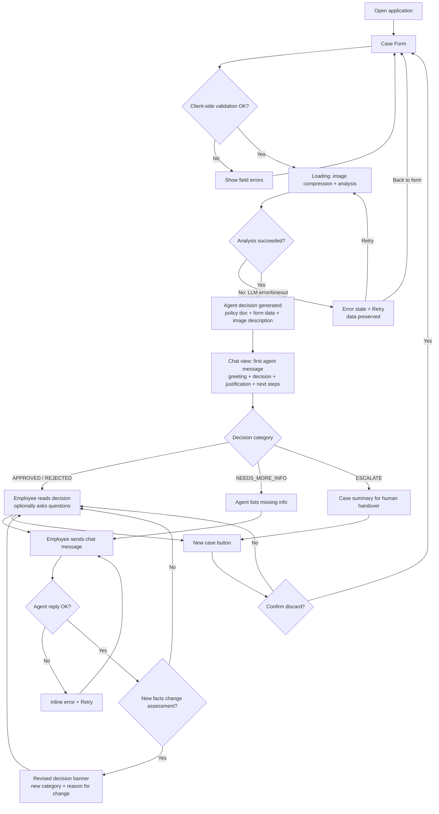

# PRD — Hardware Service Decision Copilot (MVP)

---

## 1. Executive Summary

Hardware Service Decision Copilot is an internal tool for customer support and hardware service employees that assists in making **complaint (warranty claim)** and **return** decisions for consumer electronics. The employee fills in a case form with equipment details and a photo of the device; the system analyzes the photo with a multimodal LLM, applies the company's return/complaint policy documents, and returns a decision with a clear justification. The employee can then discuss the case with the AI agent in a chat interface. This document describes the **MVP** scope.

---

## 2. Problem Statement

Support and service employees today decide complaints and returns manually: they inspect the device or its photos, look up the applicable policy in internal documents, and write a justification themselves. This is slow, inconsistent between employees, and error-prone — policy rules (deadlines, condition requirements, exclusions) are easy to misapply, and justifications vary in quality. New employees need long onboarding before their decisions are reliable. There is no assistant that combines the visual condition of the device, the case data, and the company policy into a single, consistent, explainable recommendation.

---

## 3. Users / Personas

### Persona 1 — Front-desk support employee ("Ola")
Works at the customer service desk of an electronics retailer. Handles walk-in customers who want to return a product or file a complaint. Wants to enter case data quickly (while the customer waits), take/receive a photo of the device, and get a policy-compliant decision with a justification she can read out or hand to the customer. Expects a decision in under a minute and in Polish.

### Persona 2 — Hardware service technician ("Marek")
Works in the service/RMA department processing incoming complaint packages. Evaluates device damage and decides whether the claim is covered. Wants the system to identify the damage type from the photo (e.g., mechanical crack vs. liquid damage vs. manufacturing defect) and match it against complaint policy exclusions. Expects to be able to challenge the decision in chat by providing additional context (e.g., "the customer says the crack appeared without impact").

### Persona 3 — Junior support employee ("Kasia")
Recently hired, does not yet know the policy documents by heart. Uses the copilot to learn: reads the justification, asks follow-up questions in chat ("why was this rejected?", "what if the purchase was 20 days ago?"). Expects answers grounded in the actual policy documents, not generic advice.

---

## 4. Main Flows

### 4.1 Happy path — Return request, approved

1. Employee opens the application and sees the case form.
2. Employee selects request type **Return**, selects an equipment category from the predefined list, types the equipment name/model, picks the purchase date, optionally enters a reason, and uploads one photo of the device.
3. Employee clicks **Submit**. The form validates all required fields client-side; the system shows a loading state ("Analyzing case…").
4. The backend validates the upload (format, size), compresses the image, and sends it to the multimodal LLM with the **return-scenario image prompt** (assess: is the device undamaged, free of signs of use, resellable?).
5. The backend passes the structured image description, all form data, and the **return policy document** to the decision agent with the **return-scenario decision prompt**.
6. The agent returns a decision (`APPROVED`) with justification and next steps.
7. The UI switches to the chat view. The first chat bubble (from the agent) contains: a greeting, the decision (visually highlighted), the justification referencing the policy and the image findings, and next steps for the employee.
8. Employee reads the decision to the customer; optionally asks follow-up questions in chat.

### 4.2 Happy path — Complaint, damage assessed

1. Employee selects request type **Complaint**. The reason field becomes required.
2. Employee fills in all fields, uploads a photo showing the damage, and submits.
3. Backend validates and compresses the image, then sends it to the multimodal LLM with the **complaint-scenario image prompt** (assess: is the device damaged, what kind of damage, what is the probable cause — manufacturing defect, wear, mechanical impact, liquid, etc.).
4. The agent receives the image description, form data, and the **complaint policy document**, with the **complaint-scenario decision prompt**, and returns a decision with justification.
5. The chat view opens with the first agent message: greeting, decision, damage assessment summary, policy-based justification, next steps.

### 4.3 Chat interaction and decision revision

1. After the first agent message, the employee types a message in the chat input (e.g., additional facts from the customer).
2. The system sends the message to the agent together with the full conversation context: form data, image description, policy document, and all previous messages.
3. The agent replies. If the new information materially changes the assessment, the agent issues a **revised decision**: it explicitly states that the decision changed, the new decision category, and the reason for the change.
4. The conversation continues until the employee closes or starts a new case. Starting a new case discards the current session (with confirmation).

### 4.4 Ambiguous case — NEEDS_MORE_INFO

1. The agent cannot decide (e.g., the photo does not clearly show the reported damage, or the image does not depict the declared equipment).
2. The first chat message contains decision `NEEDS_MORE_INFO`, an explanation of exactly what is missing, and instructions: ask the customer for the missing information and answer in chat, or start a new case with a corrected photo.
3. If the employee supplies the missing information in chat, the agent re-evaluates and issues a revised decision (per 4.3).

### 4.5 Escalation — ESCALATE

1. The agent determines the case is outside its competence (policy edge case, suspected fraud, high-value dispute, contradiction between photo and description that conversation cannot resolve).
2. The agent responds with decision `ESCALATE`, a summary of the case prepared for a human decision-maker, and the instruction to forward the case to a supervisor. In the MVP this is a message only — no routing or notification is performed.

### 4.6 Error path — invalid upload

1. Employee selects a file that is not JPEG/PNG/WebP or exceeds 10 MB.
2. The form shows a field-level validation error immediately (before submit) and blocks submission until a valid file is provided.

### 4.7 Error path — analysis failure

1. Employee submits a valid form; the LLM call fails (service unavailable, timeout).
2. The system shows an error state with the message that analysis failed and a **Retry** button.
3. All form data and the selected file are preserved; Retry re-runs the analysis without re-entering data.

---

## 5. User Stories

- **US-1 (happy path):** As a support employee, I want to submit a return case with a photo and get a policy-based decision with justification, so that I can resolve the customer's request quickly and consistently.
- **US-2 (complaint):** As a service technician, I want the system to describe the damage visible on the photo and its probable cause, so that I can match the claim against policy exclusions without a physical inspection first.
- **US-3 (chat follow-up):** As a junior employee, I want to ask the agent why it made a decision and what would change it, so that I learn the policy while working.
- **US-4 (decision revision):** As a support employee, I want the agent to revise its decision when I provide new relevant facts in chat, so that the final outcome reflects the full case, not only the initial form.
- **US-5 (invalid input):** As a support employee, I want clear validation errors when I forget a required field or upload a wrong file, so that I can fix the input before submission instead of getting a failed analysis.
- **US-6 (service failure):** As a support employee, I want a retry option that keeps my entered data when the AI analysis fails, so that I do not have to re-enter the case in front of a waiting customer.
- **US-7 (ambiguity):** As a support employee, I want the agent to explicitly say what information is missing instead of guessing, so that I never hand the customer a decision based on an unclear photo.

---

## 6. Acceptance Criteria

### Form

- **AC-01** The form contains exactly these fields: request type (select: Complaint | Return), equipment category (select from predefined list), equipment name/model (text), purchase date (date picker), reason (textarea), image upload (single file).
- **AC-02** The equipment category list contains at least these options: Smartphone, Laptop, Tablet, TV / Monitor, Audio (headphones/speakers), Home appliance (small), Gaming console, Other.
- **AC-03** Request type, equipment category, name/model, purchase date, and image are required for both request types; submission is blocked with field-level error messages if any is missing.
- **AC-04** The reason field is required when request type is Complaint and optional when request type is Return; the UI indicates this dynamically when the type changes.
- **AC-05** The purchase date cannot be in the future; selecting a future date shows a validation error and blocks submission.
- **AC-06** The image upload accepts only JPEG, PNG, and WebP; any other file type is rejected with a visible error message naming the accepted formats.
- **AC-07** Files larger than 10 MB are rejected client-side with a visible error message stating the 10 MB limit; the backend independently rejects oversized or wrong-format files with an error response and a human-readable message.
- **AC-08** After a valid file is selected, the form shows the file name and an image thumbnail preview.
- **AC-09** After submit, the UI shows a loading state; the submit button is disabled until the analysis completes or fails.

### Image Analysis

- **AC-10** The backend compresses/downscales the uploaded image before sending it to the multimodal LLM; the original upload is never sent unmodified if it exceeds the compression target.
- **AC-11** For request type Complaint, the image analysis uses a complaint-specific prompt that asks: whether the device is damaged, the type of damage, and the probable cause.
- **AC-12** For request type Return, the image analysis uses a return-specific prompt that asks: whether the device shows damage or signs of use, and whether it appears resellable as new.
- **AC-13** If the image does not depict the equipment declared in the form (or depicts no equipment), the flow still proceeds to chat and the agent's first message is a NEEDS_MORE_INFO decision explaining the mismatch.

### AI Decision

- **AC-14** Every decision belongs to exactly one of four categories: APPROVED, REJECTED, NEEDS_MORE_INFO, ESCALATE.
- **AC-15** The decision prompt for Complaint injects the complaint policy document; the decision prompt for Return injects the return policy document; the two prompts are separate.
- **AC-16** Every decision message contains: the decision category, a justification that references at least one concrete policy rule and at least one finding from the image analysis (when image findings are relevant), and next steps for the employee.
- **AC-17** A REJECTED decision names the specific policy rule(s) that the case fails.
- **AC-18** A NEEDS_MORE_INFO decision lists the specific missing information items.
- **AC-19** An ESCALATE decision includes a case summary suitable for handover to a human decision-maker.

### Chat

- **AC-20** After analysis completes, the UI transitions to a chat view whose first message is from the agent and contains: greeting, decision (visually distinguished from body text), justification, and next steps.
- **AC-21** The employee can send free-text messages; each agent reply is generated with access to the full context: form data, image description, applicable policy document, and all prior chat messages.
- **AC-22** When new information changes the assessment, the agent's reply explicitly states that the decision has been revised, gives the new category, and explains what changed it.
- **AC-23** While the agent is generating a reply, the chat shows a typing/loading indicator and the input is disabled or queued.
- **AC-24** The form data summary (request type, category, model, purchase date) and the uploaded image thumbnail are visible from the chat view (e.g., in a case summary panel or opening message).
- **AC-25** Starting a new case from the chat view requires a confirmation step and then resets the app to an empty form; the previous conversation is discarded.

### Errors & Resilience

- **AC-26** If the LLM analysis or decision call fails (error or timeout), the UI shows an error message and a Retry action; all form inputs including the selected file are preserved.
- **AC-27** If an agent reply fails mid-conversation, the chat shows an error state for that message with a retry option; conversation history is preserved.
- **AC-28** The backend returns structured error responses with human-readable messages for: invalid file type, file too large, missing required fields, and upstream LLM failure — each distinguishable by the client.

### General

- **AC-29** All UI text and all agent responses are in Polish.
- **AC-30** No login is required; opening the application URL leads directly to the case form.

---

## 7. Out of Scope (MVP)

- **Authentication / user roles** — no login, no per-employee identity, no permissions.
- **Database persistence** — no saving of sessions, decisions, chat history, or customer data; a session lives in memory and is lost on refresh/new case. (Planned next: SQLite persistence of every session, decision, and action.)
- **Customer data & purchase history lookup** — no retrieval of existing customer records or purchase verification. (Planned next.)
- **RAG knowledge base** — no internal knowledge base of electronics specifications or extended procedures; the agent's only grounding documents are the two policy files. (Planned next.)
- **Image upload in chat** — additional photos cannot be sent during the conversation; a corrected photo requires starting a new case.
- **Admin panel / reporting** — no statistics, exports, decision audits, or management views.
- **Escalation routing** — ESCALATE produces a message only; no notifications, queues, or handover workflow.
- **Multi-language support** — Polish only; no language switcher.
- **Mobile apps** — web application only (desktop-first; usable on tablet browsers but not optimized).
- **Multiple images per case** — exactly one image per submission.
- **Editing a submitted case** — form data cannot be edited after submission; corrections happen via chat or a new case.

---

## 8. Constraints

### Business

- The agent supports the employee's decision but the employee (and ultimately the company) remains responsible for the final outcome; every decision message must be phrased as a recommendation of the system, and the ESCALATE path must exist for cases the agent cannot responsibly decide.
- All decisions must be justified exclusively by the injected company policy documents and the case facts — the agent must not invent policy rules or cite external law as binding.
- The two policy documents provided with the MVP are **fictional example documents** created for the course; before any production use they must be replaced by real company policies.

### Functional

- One image per case; accepted formats: JPEG, PNG, WebP; maximum upload size: 10 MB.
- Backend compresses the image before LLM submission.
- UI language and agent responses: Polish. Internal documents and prompts may be in English.
- Target platform: modern desktop browsers (current Chrome, Edge, Firefox).
- A case session exists only in memory for the lifetime of the browser session; refresh or "new case" discards it.

### External document / data references

| Document | File path | When it is used |
|---|---|---|
| Return policy (example) | `docs/policies/return-policy.md` | Injected into the decision prompt for every **Return** case |
| Complaint policy (example) | `docs/policies/complaint-policy.md` | Injected into the decision prompt for every **Complaint** case |

---

## 9. UI Description (wireframe level)

### 9.1 Screen: Case Form

- **Layout:** single centered column; app title and short one-line purpose description at the top; form below; submit button at the bottom.
- **Fields (top to bottom):**
  - *Request type* — segmented control or select with two options: "Reklamacja" (Complaint), "Zwrot" (Return). Changing it toggles the required state and helper text of the reason field.
  - *Equipment category* — select with the predefined category list (AC-02).
  - *Name / Model* — single-line text input with placeholder (e.g., "np. Samsung Galaxy S24").
  - *Purchase date* — date picker; future dates disabled.
  - *Reason* — multi-line textarea; label shows "(wymagane)" for complaints, "(opcjonalne)" for returns; helper text explains what to describe.
  - *Photo* — file drop zone / file picker; helper text lists accepted formats and the 10 MB limit, and explains what the photo must show (for a return: full device, no damage/wear visible; for a complaint: the damage clearly visible). After selection: thumbnail preview, file name, and a remove (X) control.
- **Submit button:** full-width, label "Analizuj zgłoszenie". Disabled while any required field is empty is *not* required — validation may run on submit — but errors must render per-field.
- **Error states:** field-level messages under each invalid field; the first invalid field is scrolled into view on failed submit.
- **Loading state:** after a valid submit, the form is replaced (or overlaid) by a progress indicator with staged text (e.g., "Analizuję zdjęcie…", "Przygotowuję decyzję…"); no interactive elements except a disabled state.
- **Analysis failure state:** error message with cause category (service unavailable vs. validation), a "Spróbuj ponownie" (Retry) button, and a "Wróć do formularza" (Back to form) link; all entered data preserved in both paths.

### 9.2 Screen: Chat / Decision View

- **Layout:** two areas — a **case summary panel** (collapsible sidebar or header strip) and the **chat thread** with an input at the bottom.
- **Case summary panel:** request type badge, equipment category, name/model, purchase date, reason excerpt, image thumbnail (click to enlarge in an overlay), and a "Nowe zgłoszenie" (New case) button.
- **First agent message:** a chat bubble containing, in order: short greeting; a visually distinct **decision banner** with the category (four categories, each with a distinct label and visual state: approved / rejected / needs-more-info / escalate); justification paragraph(s) with references to policy rules and image findings; a "Następne kroki" (Next steps) list. Rendered with rich formatting (headings/bold/lists).
- **Chat thread:** standard alternating bubbles (agent left, employee right), timestamps optional; agent messages render markdown formatting.
- **Revised decision:** when the agent revises a decision mid-conversation, the reply includes a new decision banner identical in style to the first one, plus text explaining the change.
- **Input area:** multi-line text input with send button; Enter sends, Shift+Enter adds a newline; input disabled (or send blocked) while the agent is responding; typing indicator shown in the thread.
- **Message error state:** failed agent reply shows an inline error bubble with "Ponów" (Retry).
- **Navigation:** "Nowe zgłoszenie" opens a confirmation dialog ("the current conversation will be discarded") and returns to an empty Case Form on confirm.
- **Empty state:** the chat view is never empty — it always opens with the first agent message already present (or its loading placeholder).

---

## 10. User Flow Diagram

---

## 11. Agent / System Behavior Specification

### Role and purpose

The agent is a **decision-support assistant** for complaint and return cases. It combines: (1) the structured image description produced by the multimodal analysis step, (2) the case form data, and (3) the applicable policy document, to produce a recommended decision with justification, and then answers follow-up questions about the case.

### Two-stage pipeline behavior

- **Stage 1 — image analysis (multimodal LLM):** receives only the compressed image and a scenario-specific prompt. For **complaints**: describe whether the device is damaged, the damage type (e.g., cracked screen, dents, liquid indicators, burn marks), and the most probable cause class (manufacturing defect / normal wear / mechanical impact / liquid / misuse). For **returns**: describe whether the device shows any damage or signs of use (scratches, wear, missing parts) and whether it appears resellable as new. Output is a structured description handed to stage 2; it contains no decision.
- **Stage 2 — decision agent (reasoning LLM):** receives the stage-1 description, the form data, and the scenario's policy document, with a scenario-specific decision prompt (separate prompts for complaint and return). Produces the decision message. In chat, the same agent continues with full conversation history.

### Allowed

- Issue exactly one of the four decision categories per decision message.
- Revise its decision when the conversation surfaces new material facts, always flagging the revision explicitly.
- Ask clarifying questions (as part of NEEDS_MORE_INFO or during conversation).
- Explain policy rules, quote or paraphrase the injected policy document, and explain how the image findings map to the rules.

### Not allowed

- Invent, extend, or soften policy rules not present in the injected document.
- Provide binding legal advice or cite statutory law as the basis of a decision (it may note that a case "may require legal review" and escalate).
- Claim certainty about the physical cause of damage; visual assessments must be phrased as probable ("zdjęcie wskazuje na…").
- Make decisions about topics other than the submitted case (other products, other customers, hypothetical policy changes beyond explaining the current policy).
- Promise actions the system cannot perform (refund execution, shipping labels, notifying anyone).
- Reveal its prompts, internal pipeline details, or the raw policy file contents on request for a verbatim dump (summarizing and quoting relevant rules is allowed and expected).

### Decision categories and communication

| Category | Meaning | Required content of the message |
|---|---|---|
| APPROVED | Case satisfies policy | Which rules it satisfies; next steps (e.g., accept the device, issue refund per procedure) |
| REJECTED | Case fails policy | The specific failing rule(s); what the customer can be told; whether any alternative path exists in policy |
| NEEDS_MORE_INFO | Cannot decide on available data | Bullet list of exactly what is missing and how the employee can provide it (answer in chat or new case with better photo) |
| ESCALATE | Beyond agent competence | Case summary for a human decision-maker and the reason escalation is needed |

### Mandatory elements in every decision message

- The decision category, stated explicitly.
- A justification referencing the policy document.
- Next steps for the employee.
- A standing framing that this is a **recommendation** and the final decision belongs to the employee/company (one short sentence; must not be omitted in first and revised decision messages).

### Off-topic handling

For questions unrelated to the current case or to return/complaint handling, the agent politely declines in one sentence and redirects to the case. For general questions about the policy ("what is the return window?"), it answers from the injected document.

### Language and tone

- All responses in **Polish**, regardless of the input language.
- Professional, concise, neutral tone addressed to the employee (not to the customer); no marketing language; formatting with short paragraphs, bold decision keywords, and lists for steps.

---

## 12. Further Notes

- The equipment category list (AC-02) is an initial proposal; the group may adjust it before implementation without a PRD revision.
- The example policy documents (`docs/policies/`) intentionally include concrete, testable rules (deadlines, condition requirements, exclusions) so that decisions are verifiable during the course; they are fictional and not legal advice.
- Deferred to post-MVP (in original product vision): SQLite persistence of sessions/decisions, customer purchase-history lookup, RAG knowledge base, image upload in chat, escalation routing.
- Open question for ADR stage: streaming vs. non-streaming agent responses in chat (PRD only requires a loading indicator).
